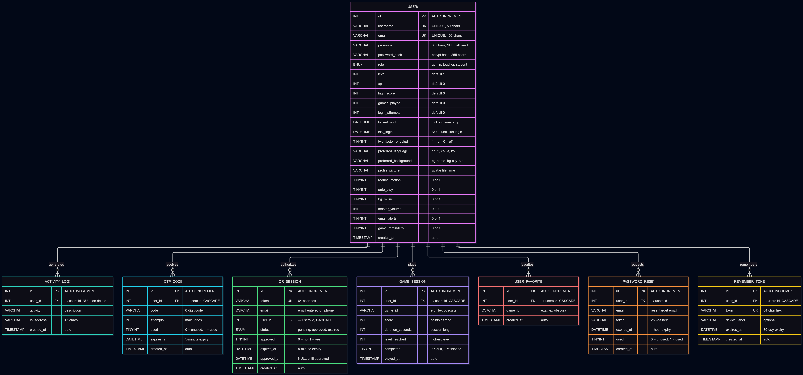

⚠️ IMPORTANT: The file config/mail_config.php contains sensitive credentials.
- NEVER commit it to GitHub
- Add "config/mail_config.php" to your .gitignore
- For production, use environment variables instead

## 📋 Project Management

Track our project progress on Trello:
[CoreSync — SIA Project Board](https://trello.com/b/YOUR-BOARD-ID/coresync-sia-project)

### Board Structure
- **Backlog** — Planned features for future sprints
- **To Do** — Current sprint tasks
- **In Progress** — Currently being developed
- **Testing** — Built, waiting for QA
- **Done** — Completed and verified

### Team
- [Your Name] — Full-stack Developer
- [Teammate 1] — Front-end
- [Teammate 2] — Documentation

## 🗄️ Database Design

See [ERD.md](documentation/ERD.md) for the complete entity relationship diagram.

### Tables Overview
- **users** — User accounts with roles (admin/teacher/student)
- **activity_logs** — Audit trail of user actions
- **password_resets** — Secure password reset tokens (1hr expiry)
- **otp_codes** — 2FA verification codes (5min expiry)
- **qr_sessions** — QR code login tokens (5min expiry)
- **game_sessions** — Game scores and progress

