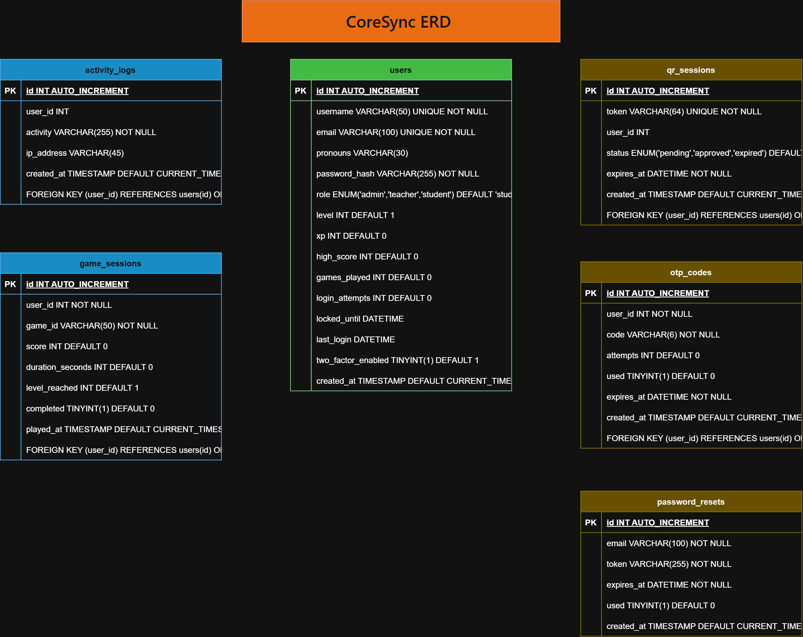

# CoreSync — Game-Integrated Learning Platform

A PHP + MySQL web platform that combines **secure authentication**, **game progress tracking**, and **analytics** into one unified system for schools and learning organizations.

**SIA Project** — System Integration & Architecture

---

## 📋 Table of Contents

- [Overview](#-overview)
- [Features](#-features)
- [Technology Stack](#-technology-stack)
- [Setup Instructions](#-setup-instructions)
- [Test Accounts](#-test-accounts)
- [Project Structure](#-project-structure)
- [Database Design](#-database-design)
- [Architecture](#-architecture)
- [Project Management](#-project-management)
- [Documentation](#-documentation)
- [Security](#-security)
- [Team](#-team)

---

## 🎯 Overview

EqualPath is a **game-integrated learning system** that blends:

- 🔐 Secure authentication (password, 2FA, QR login)
- 🎮 Integrated games that produce measurable data
- 📊 Real-time analytics and reports
- 🏆 Gamification (XP, levels, achievements)
- 👥 Role-based access control (Admin / Student)

Every game session is tracked, scored, and stored — giving admins visibility into student engagement and progress.

---

## ✨ Features

### Authentication & Security
- ✅ User registration with email validation
- ✅ Secure login with bcrypt password hashing
- ✅ **Two-factor authentication** (email OTP, admin-controlled)
- ✅ **QR code login** for mobile devices
- ✅ Forgot password with expiring tokens
- ✅ Login attempt lockout (5 attempts → 15 min)
- ✅ Session timeout (30 minutes)
- ✅ Role-based access control

### Game Platform
- ✅ Game catalog with video backgrounds
- ✅ Playable games via iframe wrapper
- ✅ Automatic score saving to database
- ✅ Score retry logic (3 server + 3 client attempts)
- ✅ XP and level system (1000 XP per level)
- ✅ Per-game and account-wide statistics

### Dashboards & Reports
- ✅ Home dashboard with game carousel and stat cards
- ✅ Library with search, filter, and sort
- ✅ User profile with game statistics
- ✅ Leaderboard (global + per-game)
- ✅ Admin panel with user management
- ✅ 2FA toggles per user
- ✅ Reports with date filter and CSV export
- ✅ Issue reporting system (players → admins)

### Activity Logging
- ✅ Every login, logout, and score save is logged
- ✅ Admin can view all activity in real-time
- ✅ Activity log preserves history even if user is deleted

---

## 🛠️ Technology Stack

| Layer | Technologies |
|---|---|
| **Frontend** | HTML5, CSS3, JavaScript (ES6+) |
| **Backend** | PHP 8.2 |
| **Database** | MySQL 8.0 |
| **Server** | Apache 2.4 (via XAMPP) |
| **Email** | PHPMailer 7.1 + Gmail SMTP |
| **Game Engine** | Godot 4.x (HTML5 export) |
| **Dev Tools** | VS Code, Git, GitHub Desktop, Trello |
| **Diagrams** | draw.io, Mermaid |

See [documentation/05-tech-stack.md](documentation/05-tech-stack.md) for details.

---

## 🚀 Setup Instructions

### Requirements
- **XAMPP** (or any LAMP/WAMP stack)
- **PHP** 8.0 or higher
- **MySQL** 5.7 or higher
- **Composer** (optional, for PHPMailer updates)

### 1. Clone the Repository

```bash
git clone https://github.com/husyt/after-class.git
```

Move the folder into XAMPP's `htdocs`:

```
D:\XAMPP\htdocs\after-class\
```

### 2. Set Up the Database

1. Open phpMyAdmin: `http://localhost/phpmyadmin`
2. Create a new database: `after_class_db`
3. Import `database.sql`:
   - Click `after_class_db` → **Import** tab → Choose file → **Go**

### 3. Configure Database Connection

Edit `config/database.php` if your MySQL uses different credentials:

```php
define('DB_HOST', 'localhost');
define('DB_NAME', 'after_class_db');
define('DB_USER', 'root');
define('DB_PASS', '');
```

### 4. Configure Email (PHPMailer)

1. Copy `config/mail_config.example.php` to `config/mail_config.php`
2. Fill in your Gmail credentials:

```php
return [
    'host'       => 'smtp.gmail.com',
    'port'       => 587,
    'username'   => 'your-email@gmail.com',
    'password'   => 'YOUR_16_CHAR_APP_PASSWORD',  // Gmail App Password, not your login password
    'from_email' => 'your-email@gmail.com',
    'from_name'  => 'CoreSync',
    'encryption' => 'tls',
];
```

**To generate a Gmail App Password:**
1. Enable 2-Step Verification at https://myaccount.google.com/security
2. Go to https://myaccount.google.com/apppasswords
3. Create a new App Password named "CoreSync"
4. Copy the 16-character password (remove spaces)

### 5. Run the Project

Visit:

```
http://localhost/after-class/public/
```

---

## 👤 Test Accounts

| Username | Password | Role |
|---|---|---|
| `admin` | `Password123!` | Administrator |
| `student` | `Password123!` | Student |

**Note:** All test accounts have 2FA enabled by default. Check the email inbox for the OTP, or disable 2FA from the admin panel after logging in as `admin`.

---

## 📁 Project Structure

```
after-class/
├── assets/                    # Static files
│   ├── audio/                 # Background music
│   └── games/                 # Game thumbnails, videos, exports
├── config/
│   ├── database.php           # PDO connection
│   └── mail_config.php        # SMTP credentials (gitignored)
├── documentation/             # Full documentation
│   ├── 01-purpose.md
│   ├── 02-architecture.md
│   ├── 03-flowchart.md
│   ├── 04-testing.md
│   ├── 05-tech-stack.md
│   ├── 06-challenges.md
│   ├── 07-client-acceptance.md
│   ├── architecture-diagram.png
│   ├── documentation_ERD.png
│   ├── erd.md
│   └── CoreSync-Trello.JPG
├── includes/
│   ├── PHPMailer/             # Email library
│   ├── functions.php          # Helper functions
│   ├── mailer.php             # Email sending
│   ├── session.php            # Session & 2FA helpers
│   └── settings_panel.php     # Settings drawer (shared)
├── public/
│   ├── css/
│   │   ├── dashboard.css
│   │   ├── settings.css
│   │   └── style.css
│   ├── js/
│   │   ├── dashboard.js
│   │   ├── qr-login.js
│   │   ├── script.js
│   │   └── settings.js
│   ├── admin.php              # Admin panel
│   ├── authenticate.php       # Login handler
│   ├── dashboard.php          # Home
│   ├── forgot_password.php
│   ├── game.php               # Game intro page
│   ├── index.php              # Login page
│   ├── leaderboard.php
│   ├── library.php
│   ├── logout.php
│   ├── play.php               # Game iframe wrapper
│   ├── profile.php
│   ├── qr_check.php
│   ├── qr_generate.php
│   ├── qr_scan.php
│   ├── register.php
│   ├── reports.php
│   ├── reset_password.php
│   ├── resolve_report.php
│   ├── save_score.php
│   ├── submit_report.php
│   ├── update_profile.php
│   └── verify_otp.php
├── database.sql               # Full database schema
├── README.md
└── .gitignore
```

---

## 🗄️ Database Design

See [documentation/erd.md](documentation/erd.md) for the complete ERD.



### Tables Overview

| Table | Purpose |
|---|---|
| **users** | User accounts with roles, XP, level, high score |
| **activity_logs** | Audit trail of all user actions |
| **password_resets** | Password reset tokens (1-hour expiry) |
| **otp_codes** | 2FA verification codes (5-minute expiry) |
| **qr_sessions** | QR code login tokens (5-minute expiry) |
| **game_sessions** | Game scores, duration, level reached |
| **issue_reports** | Player-submitted bug/issue reports |

### Design Principles
- **3NF normalization** — no duplicate data
- **Foreign keys with CASCADE** — referential integrity
- **Indexes** on frequently queried columns (`status`, `user_id`, `created_at`)
- **ENUM types** for roles, statuses, and severities

---

## 🏗️ Architecture

See [documentation/02-architecture.md](documentation/02-architecture.md) for full details.

**Architecture Pattern:** Client-Server + Layered + Component-Based

```
┌─────────────────────────────────────────┐
│  PRESENTATION LAYER                     │
│  HTML5 + CSS3 + JavaScript              │
└──────────────┬──────────────────────────┘
               │ HTTP/HTTPS
               ▼
┌─────────────────────────────────────────┐
│  APPLICATION LAYER                      │
│  PHP 8.2 + Apache 2.4                   │
│  PHPMailer + Gmail SMTP                 │
└──────────────┬──────────────────────────┘
               │ PDO Prepared Statements
               ▼
┌─────────────────────────────────────────┐
│  DATA LAYER                             │
│  MySQL 8.0                              │
│  (7 normalized tables)                  │
└─────────────────────────────────────────┘
```

See `documentation/architecture-diagram.png` for the full diagram.

---

## 📋 Project Management

Track our project progress on Trello:

🔗 **[CoreSync — SIA Project Board](https://trello.com/b/YOUR-BOARD-ID/coresync-sia-project)**

### Board Structure

| Column | Purpose |
|---|---|
| 📋 **Backlog** | Planned features for future sprints |
| 📝 **To Do** | Current sprint tasks |
| ⚙️ **In Progress** | Currently being developed |
| 🧪 **Testing** | Built, waiting for QA |
| ✅ **Done** | Completed and verified |

### Labels
- 🔴 **Critical** — Must be done for submission
- 🟢 **Feature** — New functionality
- 🟡 **Bug** — Fix required
- 🔵 **Docs** — Documentation work
- 🟣 **Testing** — QA work

---

## 📚 Documentation

| Document | Description |
|---|---|
| [01-purpose.md](documentation/01-purpose.md) | Client problem, users, scope |
| [02-architecture.md](documentation/02-architecture.md) | Architecture and layers |
| [03-flowchart.md](documentation/03-flowchart.md) | Complete user journey flowchart |
| [04-testing.md](documentation/04-testing.md) | 65 test cases, all passing |
| [05-tech-stack.md](documentation/05-tech-stack.md) | Full technology list |
| [06-challenges.md](documentation/06-challenges.md) | 10 technical challenges and solutions |
| [07-client-acceptance.md](documentation/07-client-acceptance.md) | Client requirements and sign-off |
| [erd.md](documentation/erd.md) | Entity Relationship Diagram |

### Diagram Files
- `documentation/architecture-diagram.png` — Full architecture diagram
- `documentation/documentation_ERD.png` — Database ERD
- `documentation/CoreSync-Trello.JPG` — Project management board

---

## 🔐 Security

### Authentication
- **Password hashing:** `password_hash()` with `PASSWORD_DEFAULT` (bcrypt)
- **Password verification:** `password_verify()`
- **2FA:** 6-digit email OTP, 5-minute expiry, 3-attempt limit
- **QR login:** 256-bit hex token, 5-minute expiry
- **Password reset:** 256-bit hex token, 1-hour expiry, single-use

### Session Security
- `session_regenerate_id(true)` on login
- HTTP-only cookies with `SameSite=Strict`
- 30-minute inactivity timeout
- Session destroyed on logout

### Database Security
- **PDO Prepared Statements** — prevents SQL injection
- **Bound parameters** on every query
- **Foreign key constraints** — prevents orphaned data

### Input/Output
- **Client-side validation** (JavaScript) for UX
- **Server-side validation** (PHP) for security
- **`htmlspecialchars()`** on all user output — prevents XSS
- **Generic error messages** — don't leak database details

### Rate Limiting
- **5 failed login attempts** → account locked for 15 minutes
- Admin has a manual unlock override

### Admin-Controlled 2FA
- Only admins can toggle 2FA per user
- Admins cannot toggle their own 2FA (prevents self-lockout)
- Every toggle is logged in `activity_logs`

---

## ⚠️ Important Security Note

**`config/mail_config.php` contains sensitive Gmail SMTP credentials.**

- ❌ **NEVER commit it to GitHub**
- ✅ It's already in `.gitignore`
- ✅ Use `config/mail_config.example.php` as a template
- ✅ For production, use **environment variables** instead of hardcoding

---

## 👥 Team

| Member | Role | Primary Responsibilities |
|---|---|---|
| **Edosma** | 🎯 **Project Manager** | Sprint planning, Trello board, timeline, coordination, GitHub management |
| **Kaur** | 🔍 **System Analyst** | Requirements gathering, client acceptance, testing documentation, system analysis |
| **Colminas** | 🏗️ **System Architect** | Architecture design, ERD, database schema, integration flow, system diagrams |
| **Fernandez** | 🎮 **Game Designer** | Game design, Godot development, score integration, gameplay mechanics |
| **Carpio** | 🎨 **UI Designer** | Login UI, dashboard design, CSS styling, Riot-inspired theme, responsive layouts |

### Team Contributions

- **Project Manager** — Managed the Trello board with 5 columns (Backlog, To Do, In Progress, Testing, Done) and coordinated sprint delivery
- **System Analyst** — Documented client requirements, wrote the client acceptance doc, and created the testing documentation with 65 test cases
- **System Architect** — Designed the layered + client-server architecture, created the ERD, and documented all cross-layer communication
- **Game Designer** — Built the games, integrated score saving via postMessage, and implemented the retry logic for score failures
- **UI Designer** — Designed the Riot Games-inspired login page, PS5-style dashboard, all modals, and responsive mobile layouts

## 🏆 Project Status

| Category | Status |
|---|---|
| Authentication & Security | ✅ Complete |
| Game Integration | ✅ Complete |
| Dashboards & Reports | ✅ Complete |
| Documentation | ✅ Complete |
| Testing | ✅ 65/65 tests passing |
| Version Control | ✅ GitHub |
| Project Management | ✅ Trello |
| **Overall** | **✅ Ready for submission** |

---

## 🚀 Future Enhancements

Ideas for future versions:
- 📱 Native mobile app (iOS/Android)
- 🌐 Multi-language support
- 🎮 More games in library
- 🏅 Achievement badges
- 📈 Analytics dashboard with charts
- 👨‍👩‍👧 Parent portal
- 📤 PDF report export
- ☁️ Cloud deployment (AWS/DigitalOcean)

---

## 📄 License

This project is for educational purposes as part of the System Integration & Architecture (SIA) course.

---

**Built with PHP, MySQL, and a lot of late nights.** 🎮