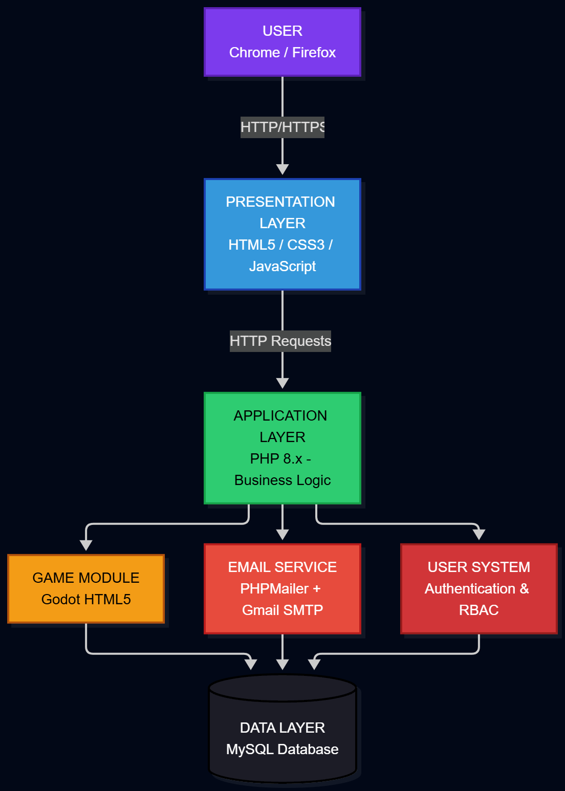

# CoreSync — System Architecture

## Architecture Pattern Used

EqualPath uses a combination of three architectural patterns:

1. **Client-Server** — Browser (client) communicates with Apache/PHP (server) over HTTP
2. **Layered Architecture** — Three distinct layers: Presentation, Application, Data
3. **Component-Based** — Reusable modules (login, dashboard, admin, etc.)

## Why This Architecture?

- **PHP + MySQL is naturally layered** — HTML/CSS handles UI, PHP handles logic, MySQL stores data
- **Client-Server** — Standard for web apps; the browser and server are separate processes
- **Component-Based** — Each feature (login, admin, profile) is its own module, making maintenance easy

## Architecture Diagram

## Layer Breakdown

### Presentation Layer (Client)
- **Technologies:** HTML5, CSS3, JavaScript
- **Files:** `public/index.php`, `public/dashboard.php`, `public/library.php`, `public/profile.php`
- **Responsibility:** Render the UI, handle user input, send requests to the Application Layer

### Application Layer (Server)
- **Technologies:** PHP 8.x
- **Files:** `public/authenticate.php`, `includes/session.php`, `public/admin.php`
- **Responsibility:** Business logic, authentication, session management, routing

### Data Layer
- **Technologies:** MySQL (via XAMPP)
- **Files:** `database.sql`, `config/database.php`
- **Responsibility:** Persistent storage of users, sessions, activity logs, and game data

## Integration Flow
## Cross-Layer Communication

| From       | To         | Method                                      |
|---         |---         |---                                          |
| Browser    | PHP        | HTTP/HTTPS (form POST, fetch API)           |
| PHP        | MySQL      | PDO prepared statements                     |
| PHP        | Gmail SMTP | PHPMailer over TLS (port 587)               |
| Godot Game | PHP        | JavaScript `postMessage` → `save_score.php` |
| Browser    | PHP (QR)   | Polling every 2s to `qr_check.php`          |