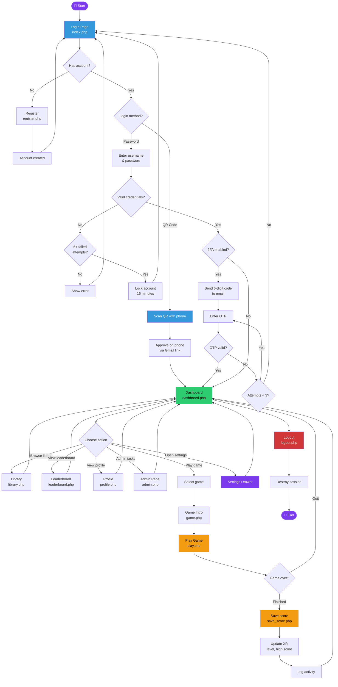
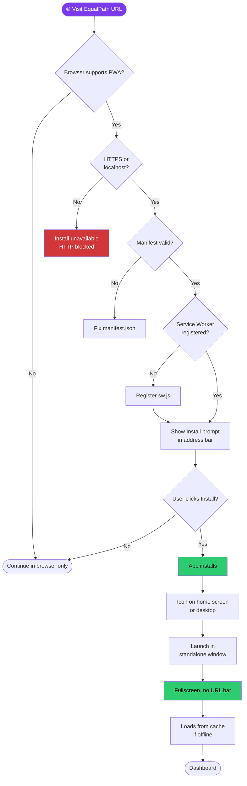
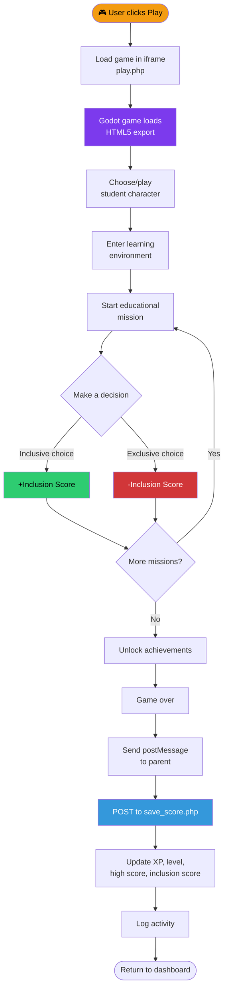
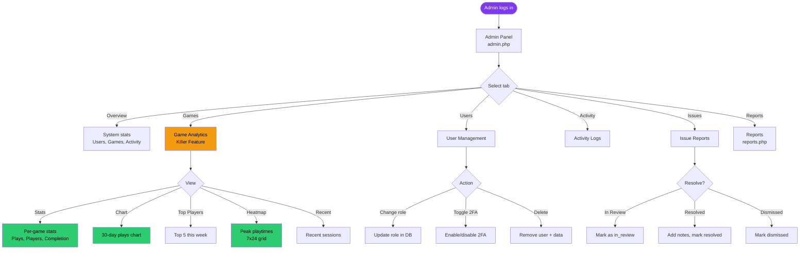

# CoreSync — System Flowchart

This document describes the complete user journey through the CoreSync platform, including authentication, 2FA, gameplay, and the PWA install flow.

---

## 1. Main User Journey

### Flow Description

#### 1. Entry Point
User opens `index.php` (login page). If a session already exists, they go directly to the dashboard.

#### 2. Registration Branch
New users click "Create account" → fill out the form → account is created and password hashed → redirected back to login.

#### 3. Authentication
Two login methods are supported:
- **Password + 2FA:** Enter credentials → check against bcrypt hash → if 2FA enabled, send OTP by email
- **QR Code:** Scan QR with phone → enter email → receive approval link → approve on phone → desktop logs in automatically

After 5 failed password attempts, the account locks for 15 minutes.

#### 4. Two-Factor Authentication
If 2FA is enabled:
- 6-digit code sent to user's email
- Code expires in 5 minutes
- Max 3 attempts

#### 5. Main Dashboard
User can navigate to:
- **Library** — browse and filter games
- **Leaderboard** — view rankings
- **Profile** — view/edit account info
- **Admin Panel** — manage users (admin only)
- **Settings** — change language, theme, audio
- **Play Game** — select and play

#### 6. Game Integration
- User picks a game → sees intro page → clicks Play
- Game runs in iframe (Godot HTML5)
- On game over, score posted via `postMessage` → `save_score.php`
- Server updates XP, level, high_score, games_played
- Activity logged, user returns to dashboard

#### 7. Session Termination
Logout destroys session, clears cookie, and regenerates session ID.

---

## 2. PWA Install Flow

### PWA Flow Description

1. **User visits the app** in any modern browser
2. **Browser checks compatibility** — PWA requires Chrome/Edge/Safari
3. **HTTPS requirement** — Chrome only allows install over HTTPS or localhost
4. **Manifest validation** — `manifest.json` must be valid with icons
5. **Service Worker** — must be registered for offline support
6. **Install prompt appears** — user sees an install icon in the address bar
7. **User clicks Install** — app is added to home screen / desktop
8. **Fullscreen launch** — no URL bar, feels like a native app
9. **Offline support** — cached pages load even without internet

### PWA Requirements Checklist

| Requirement | File | Status |
|---|---|---|
| Valid manifest | `public/manifest.json` | ✅ |
| Service Worker | `public/sw.js` | ✅ |
| Install script | `public/js/pwa.js` | ✅ |
| Icons (192, 512) | `assets/icons/` | ✅ |
| HTTPS or localhost | Server config | ✅ on localhost, ⚠️ needs HTTPS for public |

---

## 3. Educational Game Flow (SDG-Aligned)

### Game Flow Description

1. **User clicks Play** on a game intro page
2. **Godot game loads** inside an iframe on `play.php`
3. **Character selection** — student represents a diverse background
4. **Learning environment** — urban, rural, home, or classroom setting
5. **Educational mission** — task teaches a real barrier to education
6. **Decision-making** — player choices affect the Inclusion Score
7. **Achievement system** — milestones unlock rewards
8. **Game over** — sends score via `postMessage`
9. **Score saved** — XP, level, high score, and inclusion score updated
10. **Activity logged** — for admin analytics

### SDG Alignment

| SDG | How the Game Serves It |
|---|---|
| **SDG 4 — Quality Education** | Missions teach real barriers to education access |
| **SDG 10 — Reduced Inequalities** | Inclusive representation and awareness of inequality |

---

## 4. Admin Analytics Flow

### Admin Flow Description

The admin panel gives full visibility into the system:

- **Overview** — total users, games played, activity count, active today
- **Games** (Killer Feature) — full analytics dashboard with charts, top players, heatmaps, and per-game breakdown
- **Users** — manage roles, toggle 2FA, delete accounts
- **Activity** — real-time feed of all user actions
- **Issues** — resolve, dismiss, or delete player-reported bugs
- **Reports** — filter by date, export CSV, print view

---

## Related Documentation

- [01-purpose.md](./01-purpose.md) — Client and system purpose
- [02-architecture.md](./02-architecture.md) — Architecture and layers
- [04-testing.md](./04-testing.md) — 65+ test cases
- [05-tech-stack.md](./05-tech-stack.md) — Full technology list
- [06-challenges.md](./06-challenges.md) — 15 technical challenges
- [07-client-acceptance.md](./07-client-acceptance.md) — Client sign-off
- [erd.md](./erd.md) — Entity Relationship Diagram