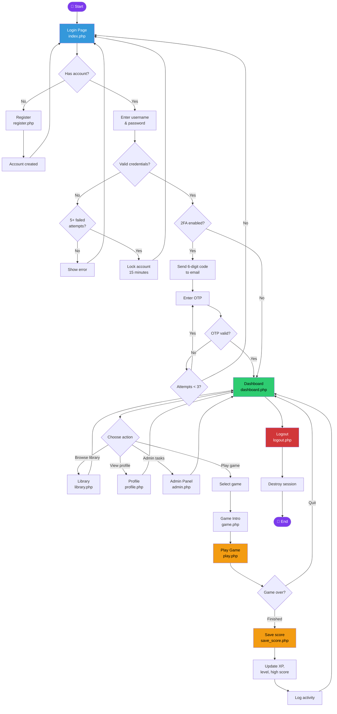

# CoreSync — System Flowchart

## User Journey

## Flow Description

### 1. Entry Point
User opens `index.php` (login page). If they already have a session, they go directly to the dashboard.

### 2. Registration Branch
New users click "Create account" → fill out the form → account is created and hashed → redirected back to login.

### 3. Authentication
- User enters credentials
- System checks against bcrypt hash in database
- After 5 failed attempts, account locks for 15 minutes

### 4. Two-Factor Authentication
If 2FA is enabled:
- 6-digit code sent to user's email
- Code expires in 5 minutes
- Max 3 attempts

### 5. Main Dashboard
User can choose between:
- **Library** — browse and filter games
- **Profile** — view/edit account info
- **Admin Panel** — manage users (admin only)
- **Play Game** — select and play

### 6. Game Integration
- User picks a game → sees intro page → clicks Play
- Game runs in iframe
- On game over, score is posted via JavaScript to `save_score.php`
- Server updates XP, level, high_score, games_played
- Activity logged, user returns to dashboard

### 7. Session Termination
Logout destroys session + cookie + regenerates ID.